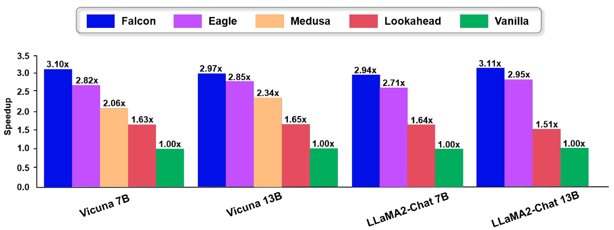
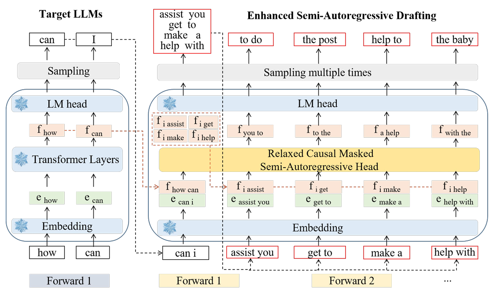
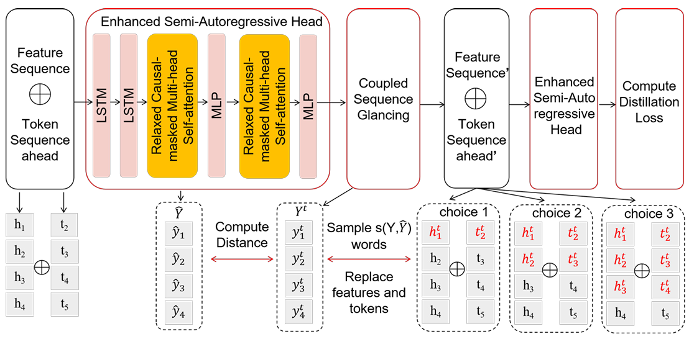
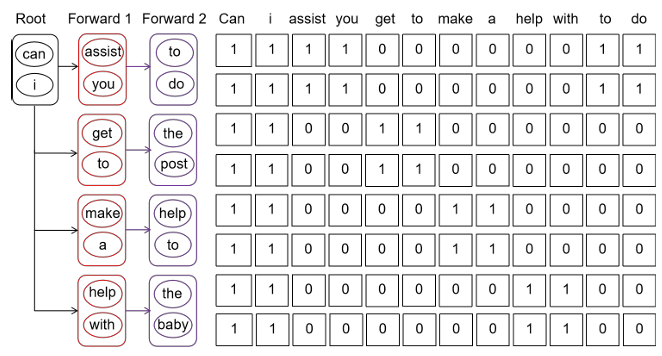

# Falcon: Faster and Parallel Inference of Large Language Models through Enhanced Semi-Autoregressive Drafting and Custom-Designed Decoding Tree



Figure 1: Speedup ratio of Vicuna and LLaMA2-Chat on MT-bench for greedy (temperature=0).

Falcon is an innovative semi-autoregressive speculative decoding framework fashioned to augment both the drafter's parallelism and output quality. Falcon incorporates the Coupled Sequential Glancing Distillation technique, which fortifies inter-token dependencies within the same block, leading to increased speculation accuracy.

## Framework of Falcon



Figure 2: Framework of Falcon. It illustrates the computational process and displays the corresponding generation results of
each forward pass for enhanced SAR drafting.

## Coupled Sequential Glancing Distillation



Figure 3: The training procedure of CSGD. $\hat{Y}$ is the initial predicted feature representation sequence of the draft model, Y t is the ground-truth feature calculated by LLMs, $t_i$ is the original token, $t^t_i$ is the target token generated by LLMs, $h_i$ is the original feature sequence, and $h^t_i$ is the target feature generated by LLMs.

## Custom-Designed Decoding Tree



Figure 4: SAR decoding tree attention illustrated. This visualization demonstrates that SAR tree attention is utilized to process multiple candidates in parallel, and k is set to 2.

## Project Structure

```
falcon/
├── models/                 # Core implementation of the Falcon acceleration framework
│   ├── falcon_model.py     # Main Falcon acceleration model
│   ├── cnets.py            # Implementation of the custom neural networks
│   ├── kv_cache.py         # Key-value cache optimizations
│   ├── modeling_llama_kv.py # LLaMA model with optimized KV cache
│   ├── modeling_qwen2_kv.py # Qwen2 model with optimized KV cache
│   ├── choices.py          # Decoding choices and configurations
│   ├── configs.py          # Configuration classes for models
│   └── utils.py            # Utility functions
├── train/                  # Training scripts for the semi-autoregressive head
├── scripts/                # Helper scripts for training and evaluation
├── evaluation/             # Evaluation tools and metrics
├── ge_data/                # Data generation and processing utilities
├── data/                   # Training and test datasets
└── figs/                   # Figures and illustrations
```

## Supported Model Series

Falcon now supports Llama series, Vicuna series, Qwen series Large Language Models.

## Falcon Weights

| Base Model            | Falcon on Hugging Face                                                             | Base Model                   | Falcon on Hugging Face                                                             | 
|-----------------------|-------------------------------------------------------------------------------------|------------------------------|-------------------------------------------------------------------------------------|
| Qwen-2.5-7B       | [Bestpay-inc/Falcon-Qwen2.5-7B](https://huggingface.co/Bestpay-inc/Falcon-qwen2.5-7B) | Qwen-2.5-14B          | [Bestpay-inc/Falcon-Qwen2.5-14B](https://huggingface.co/Bestpay-inc/Falcon-Qwen2.5-14B) |
| Qwen-2.5-32B | [Bestpay-inc/Falcon-Qwen2.5-32B](https://huggingface.co/Bestpay-inc/Falcon-qwen2.5-32B) | Qwen-2.5-72B | [Bestpay-inc/Falcon-Qwen2.5-72B](https://huggingface.co/Bestpay-inc/Falcon-qwen2.5-72B) |

## Setup & Installation

```bash
cd Falcon
pip install -r requirements.txt
```

## Train

### Generate Train data

First, you can run the following command to generate the training data

```bash
python -m ge_data.allocation
```

### Train the semi-autoregressive Head

Then run the semi-autoregressive head train script.

```bash
bash scripts/glance.sh
```

## Evaluation

You can test the speed of Falcon on MT-bench using the following command.

```bash
bash scripts/evaluate_falcon_mtbench.sh
```

You can also test the speed of Falcon on other datasets as you wish.

Then, you can use evaluation/speed.py to calculate the ratio of speeds.

```bash
cd evaluation
python speed.py
```

## Reference

For technical details and full experimental results, please check [the paper of Falcon](https://ojs.aaai.org/index.php/AAAI/article/view/34566)

@article{Gao_Xie_Xiang_Ji_2025,
title={Falcon: Faster and Parallel Inference of Large Language Models Through Enhanced Semi-Autoregressive Drafting and Custom-Designed Decoding Tree},
volume={39},
url={https://ojs.aaai.org/index.php/AAAI/article/view/34566}, DOI={10.1609/aaai.v39i22.34566},
number={22},
journal={Proceedings of the AAAI Conference on Artificial Intelligence},
author={Gao, Xiangxiang and Xie, Weisheng and Xiang, Yiwei and Ji, Feng},
year={2025},
month={Apr.},
pages={23933-23941} }
